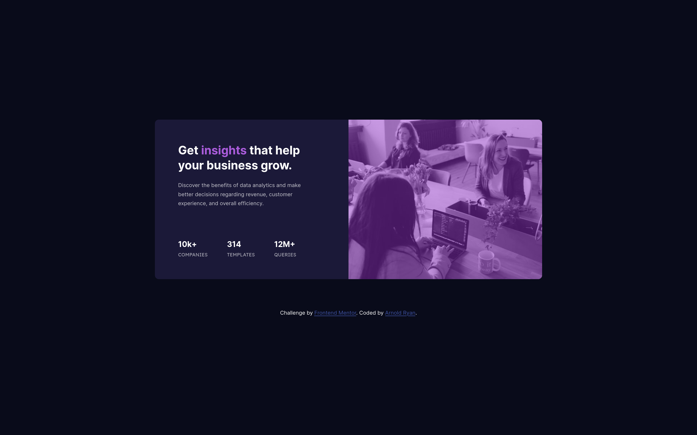

# Frontend Mentor - Stats preview card component solution

This is a solution to the [Stats preview card component challenge on Frontend Mentor](https://www.frontendmentor.io/challenges/stats-preview-card-component-8JqbgoU62).

## Table of contents

- [Overview](#overview)
  - [The challenge](#the-challenge)
  - [Screenshot](#screenshot)
  - [Links](#links)
- [My process](#my-process)
  - [Built with](#built-with)
  - [What I learned](#what-i-learned)
  - [Continued development](#continued-development)
  - [Useful resources](#useful-resources)
- [Author](#author)

## Overview

### The challenge

Users should be able to:

- View the optimal layout depending on their device's screen size
- See hover states for interactive elements

### Screenshots

#### Desktop version

#### Mobile version

### Links

- Solution URL: [Github code](https://github.com/arnold-ryan/stats-preview-card-component-main)
- Live Site URL: [Visit site](https://arnold-stats-preview-card.netlify.app/)

## My process

### Built with

- Semantic HTML5 markup
- CSS custom properties
- Flexbox
- CSS Grid

### What I learned

Using web responsive images can be tricky especially because I wasn't using the mobile-first workflow. I had to lookup:

- how to fit content inside a div where adjusting height: 100%; property of the div came in handy.
- how to play around with the viewport height and adjust content accordingly using e.g. max-height: 95%;
- how to deal with overflow
- how to add a color filter to an image. I basically used z-index and opacity to get around that but I'll have to do more semantic css research.

### Continued development

I'd like to continue learning and adapting to how to use responsive images and how to adjust them with custom css.

### Useful resources

- [Stack Overflow](https://stackoverflow.com/) - helped me with creating image filters
- [w3schools](https://www.w3schools.com/) - creating mobile responsive images
- [MDN](https://developer.mozilla.org/) - solving overflow problems on images

## Author

- Website - [Arnold Odhiambo](https://arnold-portfolio.netlify.app)
- Frontend Mentor - [@arnold-ryan](https://www.frontendmentor.io/profile/arnold-ryan
- LinkedIn - [Arnold Odhiambo](https://www.linkedin.com/in/arnold-odhiambo-dev/)
